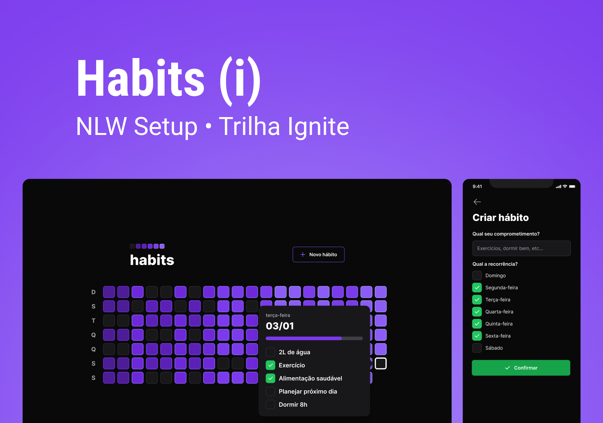

# Habits Tracker

## Tracking your habit one step at a time. 

Some tools used in this project:   
<br />
[][typescript]
[][node]
[][fastify]
[][prisma]
[][react]

<br /><br>


## Layout

Layout developed by [Rocketseat](https://www.rocketseat.com.br/)

<!-- ## 👏 Learning and more implementations

Describe what you learned and implemented in the project. -->

## Setup
### Back-end

- [x] Node.js
- [x] [Fastify](https://www.fastify.io/)
- [x] [Prisma](https://www.prisma.io/)
- [x] TypeScript
- [x] [Dayjs](https://day.js.org/)
- [x] [Zod](https://github.com/colinhacks/zod)

### Front-end Web

- [x] [Vite](https://vitejs.dev/)
- [x] React
- [x] TypeScript
- [x] [Tailwind CSS](https://tailwindcss.com/)
- [x] [Dayjs](https://day.js.org/)
- [x] [Phosphor Icons](https://phosphoricons.com/)
- [x] [Radix](https://www.radix-ui.com/)
- [x] [clsx](https://github.com/lukeed/clsx)
- [x] [Axios](https://axios-http.com/ptbr/)

### Mobile

- [x] [Expo](https://expo.dev/)
- [x] React Native
- [x] TypeScript
- [x] [NativeWind (Tailwind CSS)](https://www.nativewind.dev/)
- [x] [Dayjs](https://day.js.org/)
- [x] [React Navigation](https://reactnavigation.org/)
- [x] [clsx](https://github.com/lukeed/clsx)
- [x] [Axios](https://axios-http.com/ptbr/)
- [x] [React Native Reanimated](https://docs.swmansion.com/react-native-reanimated/)

## Running the project

Clone the project

```bash
  git clone https://github.com/wagner-deoliveira/Habits-Tracker.git
```

### Back-end

Enter the project directory

```bash
  cd Habits-Tracker\server
```

Install with dependencies

```bash
  npm i
```

Create ".env" file in the root of the project and add the code below

```bash
  DATABASE_URL="file:./dev.db"
```

Start the prisma

```bash
  npx prisma generate
```

You can also use the seed file in this project to set up your database with

```bash
npx prisma seed
```

Start the server

```bash
  npm run dev
```

### Front-end Web

Enter the project directory

```bash
  cd Habits-Tracker\web
```

Install with dependencies

```bash
  npm i
```

Start the server

```bash
  npm run dev
```

### Mobile

Enter the project directory

```bash
  cd Habits-Tracker\mobile
```

Install with dependencies

```bash
  npm i
```

Start the server

```bash
  npx expo start
```

## License
This project is licensed under the MIT

[typescript]: https://www.typescriptlang.org/
[node]: https://nodejs.org/en/
[fastify]: https://fastify.io/
[prisma]: https://prisma.io/
[react]: https://reactjs.org/